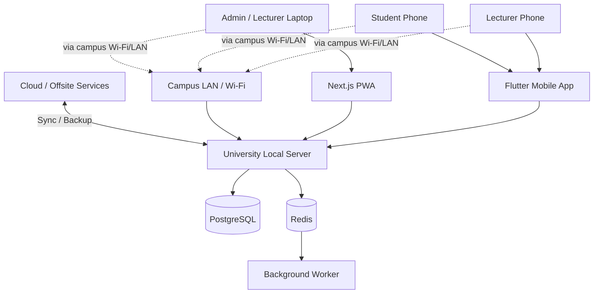
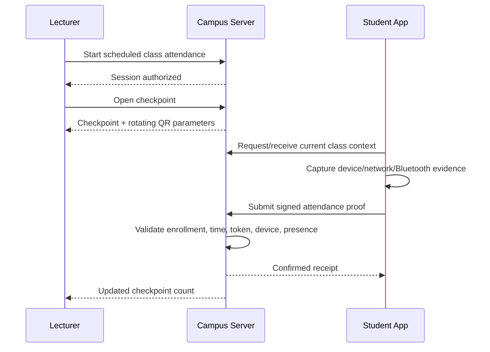

# Digital Student Attendance System
## System Architecture

**Version:** 1.0  
**Status:** Architecture baseline  
**Depends on:** Documents 00–06  
**Initial deployment:** One private university in Afghanistan  
**Designed operational scale:** 2,000–3,000 students, 200–300 lecturers  
**Architecture style:** Local-first modular monolith with hybrid mobile/PWA clients

---

## 1. Architecture Goals

The architecture must:

1. Continue normal attendance when external internet is unavailable.
2. Use the university campus LAN/Wi-Fi as the primary attendance network.
3. Support three attendance checkpoints per scheduled class.
4. Provide strong anti-cheating through multiple independent signals.
5. Support Windows/Linux lecturer workflows through a responsive PWA.
6. Support Android/iOS attendance-sensitive functions through a Flutter app.
7. Remain simple enough for a small development team and AI coding agents to maintain.
8. Preserve clean module boundaries so future university integrations are possible.
9. Avoid premature microservices.
10. Provide a safe path toward future multi-university deployment.

---

## 2. Architecture Decision Summary

| Area | Decision |
|---|---|
| Architecture | Modular monolith |
| Backend | FastAPI / Python |
| Primary database | PostgreSQL |
| Cache / transient state | Redis |
| Background jobs | Celery + Redis |
| Admin / lecturer web | Next.js + TypeScript responsive PWA |
| Attendance mobile | Flutter |
| Mobile local database | SQLite via Drift |
| Mobile state management | Riverpod |
| API | REST, versioned under `/api/v1` |
| API contract | OpenAPI generated by FastAPI |
| Deployment | Docker containers |
| Local authority | University campus server |
| Cloud role | Backup, replication, reporting, future remote services |
| Authentication | Local-capable identity; short-lived access sessions + rotating refresh credentials |
| Authorization | RBAC + organizational scope |
| Device trust | Cryptographic device registration |
| Attendance token | Signed short-lived rotating token |
| Time source | Campus server; signed offline-session timing when server unavailable |
| Sync | Transactional outbox/inbox + idempotent events |
| Source repository | Monorepo |
| CI | GitHub Actions or equivalent |
| Face recognition | Excluded from V1 |
| GPS | Optional secondary signal only |

---

## 3. High-Level Architecture



The **campus server is the operational authority for Version 1 attendance**.

Cloud connectivity is useful but not required for normal on-campus attendance.

---

## 4. Local-First Authority Model

### 4.1 Source of Truth

For Version 1:

- The campus PostgreSQL database is the operational system of record.
- Attendance-critical writes are committed locally first.
- Cloud receives replicated/synchronized records when internet is available.
- Cloud unavailability must not block attendance.

### 4.2 Why this model

This avoids a fragile architecture where every student phone must reach the internet during a 3–5 minute checkpoint.

It also minimizes conflicts between local and cloud systems.

### 4.3 Remote administration

In V1, remote cloud administration should be limited or mediated.

Preferred options:

1. Read-only remote reporting; or
2. Remote commands queued and applied by the campus server when connected.

Cloud should not independently overwrite attendance-critical records.

---

## 5. Network Architecture

Recommended campus design:

```text
Internet (optional)
       |
Campus Firewall
       |
+-----------------------------+
| Campus LAN                  |
|                             |
|  Local Attendance Server    |
|     HTTPS API :443          |
|                             |
|  Student Wi-Fi VLAN --------+--> HTTPS only to attendance service
|  Staff Wi-Fi VLAN ----------+--> HTTPS to attendance/admin service
|  Admin VLAN ----------------+--> management access
+-----------------------------+
```

### Requirements

- Student devices must never connect directly to PostgreSQL.
- Only application services expose network endpoints.
- Student network access should be restricted to required local services where practical.
- Backend database ports must remain private.
- Use HTTPS on the local network.
- Do not rely on a self-signed certificate if avoidable.

### Recommended hostname model

Use a real university-controlled hostname with split-horizon/internal DNS, for example:

```text
attendance.example.edu.af
```

Internal DNS resolves it to the campus private IP. A normal publicly trusted TLS certificate can be provisioned and renewed while internet is available.

The product must not hard-code a specific hostname or IP address.

---

## 6. Backend Architecture

The backend is a **modular monolith**.

Recommended modules:

```text
backend/
  app/
    core/
    auth/
    users/
    devices/
    academic/
    scheduling/
    attendance/
    presence/
    audit/
    notifications/
    reports/
    imports/
    sync/
    integrations/
    health/
```

### Module principles

- Modules own their business rules.
- Controllers/routes remain thin.
- Database access is not placed in UI/request handlers.
- Cross-module operations use services/interfaces.
- Attendance invariants live in the attendance domain/service layer.
- Authorization is checked server-side.
- Audit generation is automatic for sensitive actions.

---

## 7. Web/PWA Architecture

### Primary users

- Super Admin
- University Admin
- Faculty Admin
- Department Admin
- Attendance Officer
- Lecturer
- Read-only Management/Auditor
- Student general self-service

### PWA responsibilities

- Administration
- Timetable
- Course/section management
- Enrollment
- Reports
- Imports
- Policy settings
- Audit review
- Lecturer class dashboard
- Student attendance history

### PWA limitations

The PWA is **not** the only attendance-presence client because browser support for low-level Bluetooth/device capabilities is inconsistent.

High-confidence student attendance should use the Flutter mobile app.

---

## 8. Flutter Mobile Architecture

One Flutter app with role-aware interfaces.

### Student functions

- Login
- Device registration
- Today's classes
- Attendance checkpoint submission
- QR scanning if required
- Bluetooth presence proof
- Offline receipt
- Attendance history
- Notifications
- Device replacement request

### Lecturer functions

- Today's classes
- Start attendance session
- Open/close checkpoint
- Display dynamic QR
- Bluetooth session hosting/proximity support
- Scan physical student cards
- Manual fallback
- Review class attendance
- Offline-host fallback when authorized

### Recommended libraries/patterns

- Riverpod for state management
- Dio for HTTP
- Drift/SQLite for local persistence
- OS secure storage for keys/refresh credentials
- Platform Bluetooth/QR plugins behind internal adapters

Do not allow business logic to depend directly on a specific third-party plugin interface.

---

## 9. Attendance Session Architecture



---

## 10. Rotating Token Design

Recommended conceptual token:

```text
version
session_id
checkpoint_id
time_step
nonce
signature
```

Requirements:

- No student personal data.
- Short validity.
- Bound to one checkpoint.
- Signed with server-controlled secret/key.
- Replay-resistant.
- Can be independently validated by the campus server.

Do not store every rendered QR token as a database row.

Tokens should be generated deterministically or from short-lived server state and validated cryptographically.

---

## 11. Device Trust Architecture

On first approved registration:

1. Mobile app generates asymmetric key pair.
2. Private key remains in OS-protected storage where possible.
3. Public key is registered with the student's account.
4. Attendance submissions are signed by the device.
5. Server verifies signature against active registered device.

Device replacement:

- Revokes old registration.
- Creates a new registration.
- Requires authorized recovery/approval.
- Generates audit events.

---

## 12. Bluetooth Presence Architecture

Bluetooth is supporting evidence, not sole proof.

Preferred design:

- Lecturer app or authorized classroom broadcaster emits a rotating ephemeral identifier.
- Identifier is bound to active attendance session/checkpoint.
- Student app detects nearby identifier.
- Student app submits a short-lived derived proof with its attendance request.
- Server validates expected identifier/time window.

Privacy:

- Do not expose permanent student Bluetooth identifiers.
- Do not store long-term raw scan histories.
- Use rotating session identifiers.

---

## 13. Physical QR Card Fallback

For students without a smartphone:

1. Lecturer opens current checkpoint.
2. Student presents physical card.
3. Lecturer app scans the card.
4. Server checks student, enrollment, active card, session.
5. Attendance event is marked `PHYSICAL_CARD_FALLBACK`.
6. Event is auditable.

The card QR should identify a card credential, not contain private student information.

---

## 14. Offline Lecturer-Host Architecture

This mode is only used when the campus server is temporarily unavailable.

### Precondition

Before the outage, the lecturer device should have:

- Cached assigned classes
- Signed offline session permit(s)
- Lecturer device registration
- Required session key material

### Offline session permit

A permit should contain:

```text
permit_id
lecturer_id
device_key_fingerprint
course_offering_id
class_occurrence_id
allowed_start
allowed_end
allowed_checkpoint_policy
expiry
server_signature
```

The lecturer device cannot use the permit for another class.

### Offline event flow

1. Lecturer starts authorized offline session.
2. Lecturer device produces temporary rotating session proof.
3. Student app submits locally where supported.
4. Lecturer device stores signed event records.
5. On reconnection, events sync to campus server.
6. Server validates permit/signatures.
7. Duplicates are deduplicated.
8. Conflicts enter review.

---

## 15. Sync Architecture

Use the **transactional outbox pattern** for records that need replication.

Local transaction:

```text
business change
+ outbox event
= one database transaction
```

Background worker:

```text
outbox -> signed/authorized sync payload -> cloud inbox
```

Cloud uses an inbox/idempotency table so retries do not duplicate events.

Cloud should acknowledge event IDs.

---

## 16. Data Ownership

### Campus authoritative
- Students and lecturer operational identities
- Academic structure
- Timetable
- Attendance
- Attendance policies
- Device registration
- Audit events

### Cloud replicated
- Backups
- Reporting copy
- Sync metadata
- Selected configuration
- Future integrations

Future external systems may become authoritative for specific master data only after an explicit integration architecture decision.

---

## 17. Repository Architecture

Recommended monorepo:

```text
student-attendance/
├── apps/
│   ├── web/                 # Next.js PWA
│   └── mobile/              # Flutter
├── backend/                 # FastAPI
├── contracts/               # OpenAPI snapshots / generated clients
├── infra/
│   ├── docker/
│   ├── nginx/
│   └── scripts/
├── docs/
├── tests/
│   ├── e2e/
│   ├── load/
│   └── security/
├── .github/
│   └── workflows/
├── AGENTS.md
├── README.md
└── docker-compose.yml
```

---

## 18. Deployment Units

Recommended local server containers:

```text
reverse-proxy
backend-api
postgres
redis
worker
web-pwa
backup-agent
```

Optional:

```text
monitoring
log-collector
```

---

## 19. Observability

Minimum operational telemetry:

- API health
- Database health
- Redis health
- Disk usage
- Backup status
- Sync backlog
- Failed attendance submissions
- Attendance latency
- Checkpoint submission rate
- Error rate
- Login failures
- Device reset frequency

Do not log passwords, raw refresh tokens, private device keys, or sensitive QR secrets.

---

## 20. Performance Targets

Initial engineering targets:

- Support 3,000 students and 300 lecturers without redesign.
- Support multiple simultaneous 100-student checkpoints.
- Typical local API response target: < 500 ms for attendance operations under normal load.
- Attendance submission should remain functional during short network interruptions.
- Database indexes must support current-semester queries efficiently.
- Load testing must simulate burst submission at checkpoint opening.

These are engineering targets, not guarantees until validated through load tests.

---

## 21. Reliability Targets

- Attendance submission is idempotent.
- No duplicate checkpoint credit.
- Cloud outage does not block campus attendance.
- Local restart does not lose committed attendance.
- Background sync can resume after failure.
- Backup restore is tested before production.

---

## 22. Architectural Invariants

1. Campus network connectivity is not equivalent to internet connectivity.
2. Internet is not required for normal campus attendance.
3. The campus server is the V1 attendance authority.
4. PWA is not the sole high-confidence presence client.
5. Bluetooth is not the sole presence signal.
6. Student device clock is not authoritative.
7. Attendance corrections never erase history.
8. Manual/fallback/offline attendance remains identifiable.
9. One logical checkpoint cannot produce duplicate credit.
10. No microservices without an approved architecture decision.
