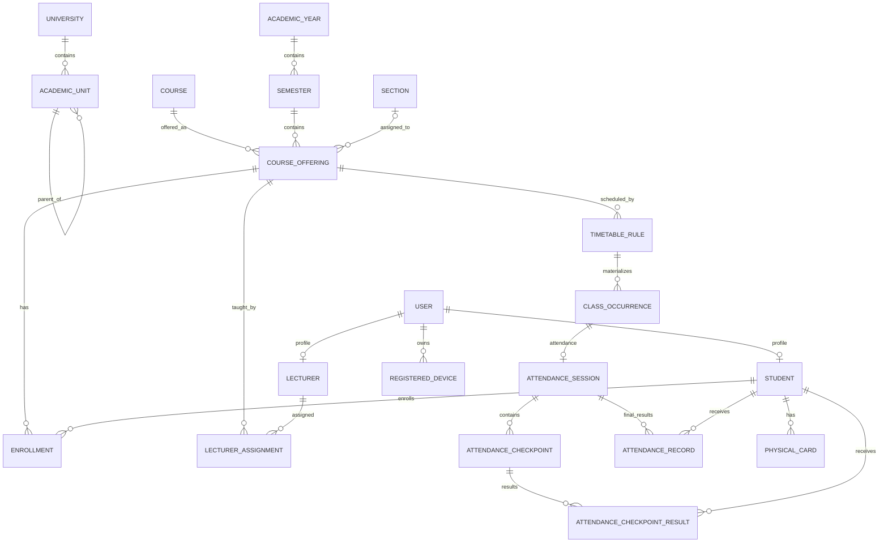

# Digital Student Attendance System
## Domain Model

**Version:** 1.0  
**Purpose:** Define business entities, aggregates, relationships, and invariants independent of database implementation.

---

## 1. Domain Areas

The system is divided into these domains:

1. Identity & Access
2. Academic Structure
3. Scheduling
4. Attendance
5. Presence & Device Trust
6. Audit
7. Notifications
8. Reporting
9. Import
10. Synchronization
11. Future Integrations

---

## 2. Identity & Access Domain

### User

Represents a person/account that can authenticate.

Key concepts:

- User ID
- Username
- Authentication status
- Language preference
- Active/disabled state

A User may be linked to:

- Student profile
- Lecturer profile
- Administrative roles

### Role

Examples:

- Super Admin
- University Admin
- Faculty Admin
- Department Admin
- Attendance Officer
- Lecturer
- Student
- Auditor

### Permission

Atomic authorization capability.

Example:

```text
attendance.session.start
attendance.correct
reports.department.read
```

### RoleAssignment

Assigns a role to a user with an organizational scope.

Example:

```text
User A
Role: Department Admin
Scope: Computer Science Department
```

---

## 3. University & Academic Structure Domain

### University

Top-level institution.

Although V1 supports one university, this entity is retained for future reuse.

### AcademicUnit

Flexible hierarchical organizational unit.

Types may include:

- FACULTY
- DEPARTMENT
- PROGRAM
- OTHER

Properties:

- Parent academic unit is optional.
- Hierarchy is not required to contain every level.

This avoids forcing:

```text
Faculty -> Department -> Program
```

when a university omits a level.

### AcademicYear

Represents academic year.

### Semester

Belongs to an academic year.

### Course

Stable catalog definition.

Examples:

- Financial Management
- Database Systems

### Section

Represents student grouping when the institution uses sections.

Sections are optional.

### CourseOffering

Represents a course offered in a specific semester, possibly for one section/program.

A course may have many course offerings.

### LecturerAssignment

Connects one or more lecturers to a course offering.

A lecturer may teach multiple sections.

### Enrollment

Connects a student to a course offering.

Enrollment state examples:

- ACTIVE
- DROPPED
- COMPLETED
- WITHDRAWN

---

## 4. Person Profiles

### Student

Linked to one User.

Properties:

- Permanent student ID
- Student number
- Name
- Academic status
- Current academic placement
- Physical QR card relationship
- Registered device relationship

### Lecturer

Linked to one User.

Properties:

- Lecturer/employee code
- Name
- Employment/active status
- Academic assignments

### Staff Profile

Optional profile for non-lecturer administrative users.

---

## 5. Scheduling Domain

### Room

Physical classroom/location.

### TimetableRule

Recurring schedule definition.

Example:

```text
Course Offering: Financial Management / Section A
Lecturer: L123
Day: Saturday
Start: 08:00
End: 09:30
Room: B-201
Valid during Semester 1
```

### ClassOccurrence

Concrete occurrence of a scheduled class on a specific date.

This is important because classes may be:

- Cancelled
- Rescheduled
- Moved
- Replaced
- Taught by substitute lecturer
- Merged

Attendance attaches to a ClassOccurrence, not directly to a recurring timetable rule.

---

## 6. Attendance Domain

### AttendanceSession

Represents attendance operation for one ClassOccurrence.

Normally there is one attendance session per class occurrence.

State examples:

- SCHEDULED
- READY
- ACTIVE
- COMPLETED
- CANCELLED
- CONFLICT_REVIEW

### AttendanceCheckpoint

A checkpoint inside an AttendanceSession.

Default kinds:

- START
- MIDDLE
- END

Each checkpoint includes:

- Sequence
- Planned open time
- Actual open time
- Close time
- State
- Token rotation policy

### AttendanceEvidence

Represents one student's evidence submitted for a checkpoint.

Evidence may contain:

- Device proof
- Token proof
- Network proof
- Bluetooth proof
- Lecturer fallback proof
- Offline session proof

### AttendanceCheckpointResult

Logical result for one student and one checkpoint.

Constraint:

```text
one student + one checkpoint = one logical result
```

### AttendanceRecord

Final class-level attendance outcome after evaluating checkpoint results and policy.

Possible status:

- PRESENT
- LATE
- ABSENT
- EXCUSED
- LEAVE
- PENDING_UNVERIFIED

### AttendancePolicy

Defines configurable rules:

- Number of checkpoints
- Duration
- Late threshold
- Minimum attendance percentage
- Checkpoint weights
- Status mapping
- Required presence signals
- Correction windows

Policies can be scoped.

### AttendanceCorrection

Represents an intentional change to a checkpoint result or final record.

Must preserve:

- Before value
- After value
- Reason
- Actor
- Timestamp
- Approval state where required

---

## 7. Presence & Device Trust Domain

### RegisteredDevice

Represents a student's or lecturer's approved mobile device.

Properties:

- Device registration ID
- User
- Public key
- Platform
- App installation identity
- Registration status
- Created/revoked timestamps

### DeviceRegistrationRequest

Represents:

- Initial registration
- Replacement
- Recovery
- Revocation

### PhysicalCard

Represents university-issued QR card credential.

Properties:

- Card ID
- Student
- Credential identifier
- Status
- Issued/revoked timestamps

### PresenceSignal

Abstract concept representing evidence such as:

- CAMPUS_NETWORK
- BLUETOOTH
- DEVICE_SIGNATURE
- DYNAMIC_TOKEN
- PHYSICAL_CARD
- MANUAL_VERIFICATION

### RiskFlag

Represents suspicious pattern requiring review.

Examples:

- SHARED_DEVICE
- FREQUENT_DEVICE_RESET
- MISSING_BLUETOOTH
- OFF_NETWORK
- MASS_MANUAL_MARKING
- EXCESSIVE_CORRECTIONS
- UNUSUAL_SESSION_TIME

RiskFlag is not an automatic accusation of cheating.

---

## 8. Offline Domain

### OfflineSessionPermit

Signed server authorization allowing one lecturer device to manage one class occurrence during a local-server outage.

### OfflineAttendanceEvent

Attendance evidence created under an OfflineSessionPermit.

Must remain distinguishable after synchronization.

---

## 9. Audit Domain

### AuditEvent

Immutable history entry.

Fields conceptually include:

- Actor
- Action
- Target entity
- Target ID
- Before state
- After state
- Reason
- Timestamp
- Device/session context
- Request/correlation ID

Sensitive business changes should always create an AuditEvent.

---

## 10. Notification Domain

### Notification

User-facing system message.

Examples:

- Attendance below threshold
- Attendance correction
- Missed class
- Device reset approval
- Risk of exam ineligibility

V1 delivery channel:

- In-app

Future:

- Email
- SMS
- WhatsApp

---

## 11. Import Domain

### ImportJob

Represents an Excel/CSV import.

### ImportRowResult

Tracks:

- Valid
- Invalid
- Duplicate
- Created
- Updated
- Rejected

Import must be auditable.

---

## 12. Synchronization Domain

### OutboxEvent

Reliable event created in same transaction as local business change.

### SyncInboxRecord

Records events already accepted remotely.

### SyncConflict

Represents unresolved disagreement requiring deterministic rule or human review.

---

## 13. Important Relationships



---

## 14. Aggregate Boundaries

Recommended aggregates:

### AttendanceSession Aggregate

Root:

- AttendanceSession

Contains/controls:

- Checkpoints
- Checkpoint state transitions
- Token policy
- Session host/authority

### AttendanceRecord Aggregate

Root:

- AttendanceRecord

Controls:

- Final status
- Calculation result
- Correction state

### RegisteredDevice Aggregate

Controls:

- Active/revoked device
- Public key
- Device replacement lifecycle

### CourseOffering Aggregate

Controls:

- Course
- Semester
- Section
- Lecturer assignments
- Enrollments

---

## 15. Key Domain Invariants

1. A student may only submit normal attendance for an active enrollment.
2. A class occurrence belongs to exactly one course offering.
3. One logical checkpoint result exists per student per checkpoint.
4. One final attendance record exists per student per attendance session.
5. Attendance session must reference a real class occurrence.
6. Lecturer must be authorized for the class or have explicit substitute authorization.
7. Expired checkpoint cannot accept a normal submission.
8. Cancelled class does not generate absence.
9. Manual/fallback/offline records remain identifiable.
10. Correction never destroys historical state.
11. Device replacement revokes or deactivates old active registration.
12. Physical card credential must be revocable.
13. Student device clock never determines validity.
14. Offline permit cannot authorize another class.
15. Risk flags do not automatically alter academic attendance without policy/review.
