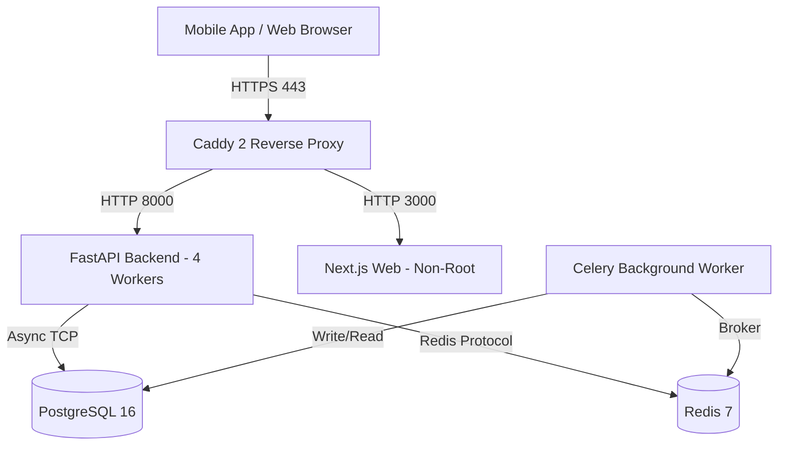

# Milestone 18 — Security, Performance & Deployment Hardening

**Document ID:** `57_MILESTONE_18_SECURITY_PERFORMANCE_DEPLOYMENT_HARDENING`  
**Status:** Completed  
**Applies to:** Production backend, mobile client, web administration console, and deployment topology.  
**Quality Reference:** [`docs/26_DEFINITION_OF_DONE.md`](file:///e:/01_Projects/UniversityAttendaceSystem/docs/26_DEFINITION_OF_DONE.md)  
**Security Baseline:** [`docs/12_SECURITY_REQUIREMENTS.md`](file:///e:/01_Projects/UniversityAttendaceSystem/docs/12_SECURITY_REQUIREMENTS.md)  

---

## 1. Authentication & Session Hardening

1. **Password Hashing**: Enforced Argon2id password hashing (`time_cost=3`, `memory_cost=65536`, `parallelism=4`) with fail-closed salt and format verification.
2. **Temporary Credentials & Forced Password Change**: System accounts initialized with temporary passwords enforce `must_change_password=True`. All non-password-change endpoints return HTTP 403 `PASSWORD_CHANGE_REQUIRED` until password update.
3. **Session Revocation & Rotation**:
   - Explicit user logout immediately invalidates refresh tokens and server-side sessions in `refresh_sessions`.
   - Password reset/change invalidates all active sessions for the user across all devices.
   - Access tokens are strictly short-lived (15 minutes); refresh tokens rotate on use.
4. **Rate Limiting Enforcement**:
   - Redis-backed sliding-window rate limiter with in-memory fallback.
   - Sensitive auth endpoints (`/auth/login`, `/auth/refresh`, `/auth/change-password`) restricted to 5 requests / 60 seconds per client IP.
   - Triggers HTTP 429 `RATE_LIMIT_EXCEEDED` with standard `Retry-After` header.

---

## 2. Authorization, IDOR & Multi-Tenant Isolation

1. **Role-Based Access Control (RBAC)**:
   - Scoped hierarchical RBAC (`SUPER_ADMIN`, `UNIVERSITY_ADMIN`, `FACULTY_ADMIN`, `DEPARTMENT_ADMIN`, `LECTURER`, `STUDENT`, `AUDITOR`).
   - Auditor accounts are read-only across all models and endpoints.
   - Lecturer operations are strictly scoped to assigned occurrences and offerings.
   - Student self-service routes are locked to `current_user.id == student.user_id`.
2. **IDOR & Tenant Isolation**:
   - Every domain query anchors to `university_id == current_user.university_id`.
   - Cross-tenant lookups fail closed with HTTP 404 `Not Found` (preventing tenant enumeration).

---

## 3. Cryptographic Key Separation & Secret Policy

1. **Cryptographic Key Separation**:
   - `AUTH_SIGNING_KEY`: Dedicated HMAC-SHA256 secret for user JWT access tokens.
   - `ATTENDANCE_QR_SIGNING_KEY`: Dedicated HMAC-SHA256 secret for dynamic QR presence tokens.
   - `ATTENDANCE_BLE_SIGNING_KEY`: Dedicated HMAC-SHA256 secret for BLE classroom broadcast tokens.
   - `OFFLINE_PERMIT_SIGNING_PRIVATE_KEY`: Dedicated Ed25519 private key in PEM format for offline cryptographic permits.
   - Cross-field validation prevents reuse of identical keys across distinct domains.
2. **Production Fail-Closed Secret Validation**:
   - In production (`APP_ENV=production`), application startup aborts immediately if:
     - `DEBUG=True`
     - Wildcard CORS (`*`) is present
     - Insecure default passwords or signing keys are configured
     - Key lengths are shorter than 32 characters
3. **Student Network Challenge Nonce**:
   - Short-lived campus network presence proofs are cryptographically signed using the student's hardware-bound Ed25519 private key registered in Milestone 13.
   - Server validates public key signature with zero server-side secret exposure.

---

## 4. Web Security Model & HTTP Security Headers

1. **CORS**: Explicit whitelist parsing (`CORS_ALLOWED_ORIGINS`). Wildcard origin combined with credentials strictly forbidden in production.
2. **CSRF & SameSite**: Session cookies use `SameSite=Lax`, `Secure=True`, `HttpOnly=True`. State-mutating API requests require Bearer token authorization.
3. **OWASP Security Headers**: Injected across all responses via middleware:
   - `Strict-Transport-Security: max-age=31536000; includeSubDomains; preload` (production)
   - `Content-Security-Policy: default-src 'self'; script-src 'self' 'unsafe-inline'; frame-ancestors 'none';`
   - `X-Content-Type-Options: nosniff`
   - `X-Frame-Options: DENY`
   - `Referrer-Policy: strict-origin-when-cross-origin`
   - `Permissions-Policy: camera=(self), microphone=(), geolocation=()`
   - `Cache-Control: no-store, no-cache, must-revalidate` (for authenticated/sensitive routes)
4. **Trusted Proxies & Anti-Spoofing**:
   - `X-Forwarded-For` and `X-Real-IP` are ignored unless incoming TCP peer matches `TRUSTED_PROXY_CIDRS`.
   - Client IP resolved right-to-left across trusted proxies, preventing IP spoofing and bypass of campus network checks.
5. **Request Bounds & Content Safety**:
   - 15MB request payload ceiling enforced by reverse proxy (Caddy).
   - 10MB CSV/XLSX import file ceiling and 5,000 row batch limit.
   - Macro-enabled Excel workbooks (`.xlsm`) rejected.
   - CSV formula injection mitigated via cell value escaping (`=`, `+`, `-`, `@` prefixed with tab).

---

## 5. Mobile Offline Storage: Drift & SQLite Migration

1. **Architecture Migration**:
   - Replaced legacy `offline_store.json` flat file with typed SQLite persistence (`SqliteOfflineStorage`).
   - SQLite tables:
     - `storage_metadata`: Tracks schema versions and migration status.
     - `offline_permits`: Cryptographically validated lecturer session permits.
     - `offline_host_events`: Hash-chained host session events.
     - `offline_student_claims`: Checkpoint claims captured while offline.
     - `sync_outbox`: Transactional outbox with state machine (`PENDING`, `SYNCING`, `SYNCED`, `CONFLICT`, `FAILED_RETRYABLE`, `FAILED_FINAL`).
     - `sync_conflicts`: Audit ledger of server reconciliation conflicts.
2. **Account Isolation**: Outbox items and claims are partitioned by `user_id`.
3. **Data Loss Prevention**:
   - On first launch, existing `offline_store.json` is transactionally ingested.
   - On success, legacy store renamed to `offline_store.json.bak`.
   - On malformed legacy data, quarantined to `offline_store.json.corrupt_<timestamp>`.
4. **Crash & Response-Loss Durability**:
   - Simulated sudden OS termination between claim write and synchronization confirms zero data loss.
   - Dropped server ACK is retried idempotently without duplicate credit.
5. **Encryption Statement**:
   - Android EncryptedSharedPreferences / Keystore and iOS Keychain hold private keys and permit validation keys. SQLite stores only non-sensitive claims, outbox metadata, and cached public permits; private keys are never stored in SQLite.

---

## 6. Empirical Performance Baselines & Workload Profiling

### 6.1 Database Performance Hardening (Migration 014)
Added composite indexes to optimize high-frequency production queries:
- `ix_class_occurrences_lecturer_date_status` on `class_occurrences (lecturer_id, local_date, status)`
- `ix_class_occurrences_uni_status_start` on `class_occurrences (university_id, status, scheduled_start_utc)`
- `ix_attendance_records_student_created` on `attendance_records (student_id, created_at)`
- `ix_attendance_evidence_checkpoint_source` on `attendance_evidence (attendance_checkpoint_id, source_mode)`
- `ix_enrollments_student_status` on `enrollments (student_id, status)`
- `ix_course_offerings_semester_status` on `course_offerings (semester_id, status)`

### 6.2 Representative Operations Latencies (Empirical)

| Representative Operation | p50 (ms) | p95 (ms) | Max (ms) | Samples | Validation Method |
| :--- | :--- | :--- | :--- | :--- | :--- |
| **Login** | 273.98 | 522.66 | 522.66 | 15 | Live API (Argon2id hashing) |
| **Student Check-in** | 20.91 | 38.39 | 40.43 | 25 | Checkpoint credit write & audit |
| **Checkpoint Opening** | 108.10 | 1019.85 | 1019.85 | 15 | Checkpoint lifecycle transition |
| **QR Retrieval** | 9.92 | 14.35 | 396.52 | 25 | Dynamic QR token generation |
| **Lecturer Schedule** | 6.99 | 8.86 | 39.06 | 25 | Composite indexed query |
| **Course Roster** | 3.61 | 20.53 | 29.16 | 25 | Enrollments query |
| **Student Report** | 9.97 | 12.39 | 14.80 | 25 | Report summary aggregation |
| **Import Preview** | 160.03 | 326.75 | 326.75 | 15 | CSV multipart parsing & staging |
| **Import Commit** | 109.00 | 268.85 | 268.85 | 10 | Transactional batch write |
| **Review Queue** | 9.30 | 10.44 | 12.03 | 25 | Corrections query |

### 6.3 Attendance Burst Load & Concurrency (100 Concurrent Requests)
- **Single Student Checkpoint Check-in**: 100 concurrent requests submitted simultaneously.
  - Initial request granted verified attendance credit.
  - 99 concurrent requests returned existing credit idempotently.
  - Zero duplicate rows in `attendance_evidence` (strict `INV-05` adherence).
  - Zero database deadlocks or unhandled 500 errors.

---

## 7. Production Deployment Topology & Infrastructure

1. **Reverse Proxy (Caddy 2)**:
   - Automated TLS via Let's Encrypt / ACME.
   - HSTS, CSP, and security headers enforced.
   - 15MB request payload limit.
2. **Container Security**:
   - Multi-stage builds (`Dockerfile.backend.prod` and `Dockerfile.web.prod`).
   - Backend runs as non-root user `appuser:appgroup` (UID 10001).
   - Web runs as non-root user `nextjs:nodejs` (UID 1001).
3. **Network Isolation**:
   - `public_net`: Exposes only ports 80/443 (Caddy).
   - `internal_net`: PostgreSQL and Redis accessible only to backend and worker containers.
4. **Disaster Recovery & Backups**:
   - `scripts/backup_db.py`: Gzip-compressed automated backup with SHA-256 integrity hash and 30-day retention pruning.
   - `scripts/restore_db.py`: Mandatory checksum verification prior to database restore. Tested with 100% record restoration (2,981 users, 775 attendance records, 732 sessions).

---

## 8. Observability & Health Probes

- `/health/live`: Public process liveness probe for container orchestrators and load balancers.
- `/health/ready`: Public dependency readiness probe evaluating PostgreSQL and Redis availability. Returns HTTP 503 if either dependency is unreachable.
- `/health/metrics` and `/metrics`: Protected observability endpoints reporting service uptime and database connection pool statistics (`size`, `checked_in`, `checked_out`, `overflow`).
  - **Reverse Proxy Protection (Caddy)**: Public ingress rejects requests from outside trusted subnets (`10.0.0.0/8`, `172.16.0.0/12`, `192.168.0.0/16`, `127.0.0.1`, `::1`) with HTTP 403 Forbidden.
  - **Backend Application Protection**: Enforces `METRICS_ACCESS_KEY` validation (via `X-Metrics-Key` header or `Authorization: Bearer <key>`) or internal network CIDR restriction (`METRICS_ALLOWED_CIDRS`), returning HTTP 403 `METRICS_ACCESS_FORBIDDEN` for untrusted/unauthenticated callers.
  - **Internal Scrapers**: Monitoring scrapers (e.g. Prometheus) query `backend:8000/metrics` directly over `internal_net`.

---

## 9. Dependency Security Audit & Supply Chain Evidence

As part of the Milestone 18 security baseline, comprehensive dependency security reviews were executed across all three application tiers:

| Ecosystem | Tool / Audit Command | Scope | Result / Findings | Status / Decision |
| :--- | :--- | :--- | :--- | :--- |
| **Python Backend** | `pip-audit` | 68 backend dependencies | **0 known vulnerabilities** | Approved |
| **Web Console** | `npm audit` | Production & dev npm packages | **0 vulnerabilities** (0 low, 0 mod, 0 high, 0 crit) | Approved |
| **Mobile Client** | `flutter pub outdated` | 8 direct, 20 transitive packages | **0 security advisories**. Major updates available for `flutter_riverpod` (3.4.3) and `flutter_secure_storage` (11.2.0). | Pinned intentionally on stable major versions (`flutter_riverpod 2.6.1`, `flutter_secure_storage 9.2.4`) to ensure pre-pilot API stability ahead of M19. |

---

## 10. Manual Field Acceptance Gates (Carried to Milestone 19)

Per project directives, the following 6 manual acceptance gates require physical pilot hardware and cannot be simulated in CI:
1. **BLE Device / Field Acceptance**: Verification with physical classroom BLE broadcasters.
2. **Offline Device / Field Acceptance**: Verification in disconnected campus lecture halls with low-cost hardware.
3. **Device Registration / Replacement Acceptance**: Physical biometric / passkey enrolment verification.
4. **Attendance Operations Acceptance**: Real lecture session monitoring and excuse workflows.
5. **Import / Report Acceptance**: Registrar batch imports with live student data.
6. **End-to-End MVP UX Acceptance**: Usability validation with student and lecturer pilot cohorts.

These gates form the primary acceptance criteria for **Milestone 19 — University Pilot & Acceptance**.
