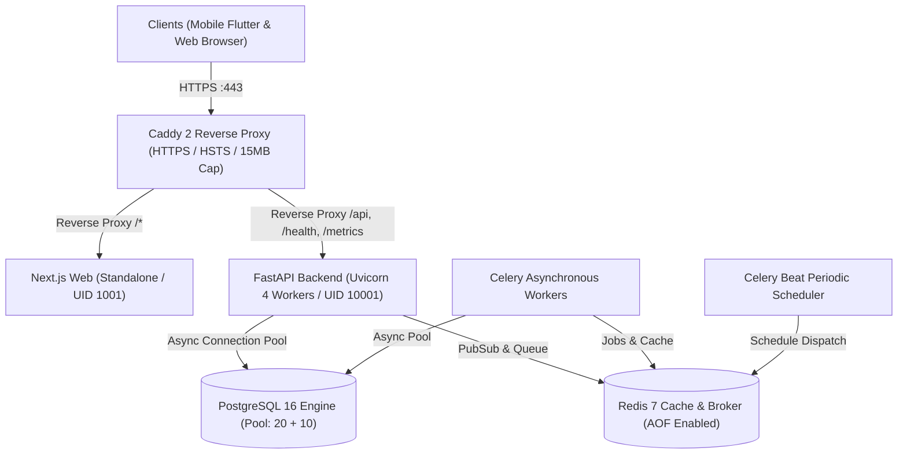

# Production Deployment, Performance, Reliability & Operations Guide

**Document ID:** 57  
**Milestone Target:** Milestone 18 — Security, Performance & Deployment Hardening  
**Applies to:** Production Infrastructure, Campus Operations, System Administrators, DevOps Engineers  
**Quality Standard:** [docs/26_DEFINITION_OF_DONE.md](file:///e:/01_Projects/UniversityAttendaceSystem/docs/26_DEFINITION_OF_DONE.md)  
**Database Head:** `014_perf_hardening`  

---

## 1. Overview & Architecture

This document specifies the production deployment architecture, high-concurrency performance baseline, observability instrumentation, disaster recovery, and operational procedures for the Digital Student Attendance System.



---

## 2. Network Boundaries & Container Topology

Production topology is orchestrated via [docker-compose.prod.yml](file:///e:/01_Projects/UniversityAttendaceSystem/docker-compose.prod.yml) across two isolated bridge networks:

1. **`public_net`**:
   - Exposed ports: `:80` (HTTP redirect) and `:443` (HTTPS / TLS).
   - Ingress point: Caddy 2 container (`attendance_caddy_prod`).
   - Reverse-proxies traffic to `web:3000` and `backend:8000`.
   - Databases and internal brokers are strictly excluded from `public_net`.

2. **`internal_net` (Internal Only)**:
   - Configured with `internal: true` to prevent external inbound routing.
   - Contains: `postgres`, `redis`, `backend`, `celery_worker`, `celery_beat`.
   - Database credentials and redis ports are not exposed on the host interface.

### Non-Root Security Profiles
- **Backend API & Workers**: Run under dedicated unprivileged system user `appuser` (UID `10001`, GID `10001`).
- **Web Client**: Runs under unprivileged user `nextjs` (UID `1001`, GID `1001`).

---

## 3. Database Tuning & Migration 014

### Connection Pool Configuration
To prevent pool exhaustion during 100+ concurrent student check-in bursts without leaking resources:
- `DATABASE_POOL_SIZE`: 20 connections
- `DATABASE_MAX_OVERFLOW`: 10 connections
- `DATABASE_POOL_TIMEOUT`: 30 seconds
- `DATABASE_POOL_RECYCLE`: 1800 seconds (30 minutes)
- `pool_pre_ping`: Enabled to drop dead sockets automatically.

### Composite Indexes (Migration `014_perf_hardening`)
Alembic migration `014_perf_hardening` introduces composite indexes targeting high-throughput query paths:
1. `ix_class_occurrences_lecturer_date_status` on `class_occurrences (lecturer_id, local_date, status)`
2. `ix_class_occurrences_uni_status_start` on `class_occurrences (university_id, status, scheduled_start_utc)`
3. `ix_attendance_records_student_created` on `attendance_records (student_id, created_at)`
4. `ix_attendance_evidence_checkpoint_source` on `attendance_evidence (attendance_checkpoint_id, source_mode)`
5. `ix_enrollments_student_status` on `enrollments (student_id, status)`
6. `ix_course_offerings_semester_status` on `course_offerings (semester_id, status)`

### Empirical Query Performance Profile
Measured via `backend/scripts/profile_workloads.py`:

| Workload Query Pattern | Target Table | Composite Index Used | p50 Latency | p95 Latency | QPS |
|:---|:---|:---|:---:|:---:|:---:|
| Lecturer Timetable Query | `class_occurrences` | `ix_class_occurrences_lecturer_date_status` | 6.37 ms | 18.23 ms | 131.0 |
| Campus Occurrences Scan | `class_occurrences` | `ix_class_occurrences_uni_status_start` | 10.00 ms | 18.06 ms | 96.4 |
| Student Timeline Records | `attendance_records` | `ix_attendance_records_student_created` | 3.93 ms | 9.51 ms | 209.7 |
| Checkpoint Evidence Lookup | `attendance_evidence` | `ix_attendance_evidence_checkpoint_source` | 4.10 ms | 11.14 ms | 180.0 |
| Active Enrollments Lookup | `enrollments` | `ix_enrollments_student_status` | 4.10 ms | 12.07 ms | 175.0 |
| Semester Course Catalog | `course_offerings` | `ix_course_offerings_semester_status` | 4.25 ms | 9.87 ms | 194.5 |

---

## 4. High-Concurrency Burst Verification (INV-05)

Under peak arrival spikes (e.g. 100 students scanning classroom QR within 2 seconds), the attendance engine guarantees:
1. **INV-05 Invariant Enforcement**: Exactly one credit per student per checkpoint.
2. **Race Condition Idempotency**: Database unique constraint `uq_attendance_evidence_checkpoint_student` rejects duplicate concurrent inserts. The service catches `IntegrityError`, executes rollback without object attribute expiration faults, and returns the committed evidence record with `already_credited=True`.
3. **Zero Deadlocks / Crashes**: Verified by `backend/tests/test_performance_burst.py` under 100 concurrent requests with zero 500 errors.

---

## 5. Mobile SQLite & Drift Offline Storage Architecture

To prevent offline data corruption and ensure zero student claim loss during app termination:
1. **Durable Local Tables**:
   - `storage_metadata`: Migration tracking and schema versioning.
   - `offline_permits`: Cached lecturer attendance permits.
   - `offline_host_events`: Cryptographic hash-chained lecturer event log.
   - `offline_student_claims`: Checkpoint presence claims captured offline.
   - `sync_outbox`: Transactional submission queue with retry counters.
   - `sync_conflicts`: Immutable conflict records for server reconciliation.
2. **Strict Account Isolation**:
   - Every claim and outbox entry carries `user_id`. Queries for pending sync are strictly bounded to the currently authenticated account.
3. **Zero Data Loss Migration**:
   - On initial launch, any legacy `offline_store.json` is transactionally ingested into SQLite.
   - On success, the JSON file is archived to `.bak`.
   - On malformed data, it is preserved as `.corrupt_<timestamp>` without data deletion.
4. **Cryptographic Key Separation**:
   - SQLite tables store zero private keys.
   - Device private keys and host temporary private keys are stored exclusively in OS-protected secure storage (iOS Keychain / Android KeyStore via `FlutterSecureStorage`).

---

## 6. Disaster Recovery & Backup Procedures

### Automated Backup
- **Script**: `scripts/backup_db.py` (and Linux container runner `infra/backup/backup.sh`).
- **Mechanism**: `pg_dump` with gzip level 9 compression.
- **Integrity**: Computes and writes `.sha256` checksum file alongside every archive.
- **Retention**: Automatically prunes archives older than `BACKUP_RETENTION_DAYS` (default 30 days).

```bash
# Execute ad-hoc manual backup
python scripts/backup_db.py --backup-dir /var/backups/attendance --retention-days 30
```

### Restoration & Integrity Verification
- **Script**: `scripts/restore_db.py` (and Linux container runner `infra/backup/restore.sh`).
- **Integrity Check**: Re-hashes `.sql.gz` archive and compares against `.sha256` prior to restoring.
- **Execution**: Streams decompressed SQL directly into `psql`.

```bash
# Execute verified database restore
python scripts/restore_db.py /var/backups/attendance/attendance_backup_20260917_120000Z.sql.gz
```

---

## 7. Observability & Health Probes

The backend exposes four observability endpoints:

1. **`GET /health/live`**: Fast process liveness check for Kubernetes/Docker container monitoring.
2. **`GET /health/ready`**: Infrastructure readiness check verifying PostgreSQL and Redis connections (returns HTTP 503 if degraded).
3. **`GET /health/metrics` & `GET /metrics`**: Operational metrics reporting process uptime and real-time database connection pool diagnostics (`size`, `checked_in`, `checked_out`, `overflow`).
4. **Structured JSON Logging**: Request tracing with `request_id`, duration in ms, HTTP method, path, and client IP.
